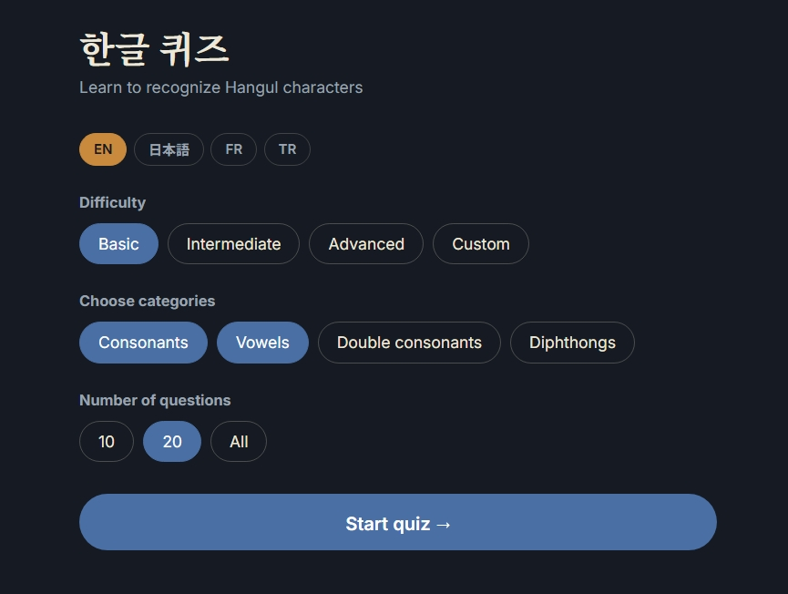

<p align="center">
  
</p>

<h1 align="center">Hangul Rush</h1>

<p align="center">
  A fast and clean Korean alphabet quiz app.
</p>
# 한글 퀴즈 — Hangul Rush

An interactive quiz app for learning to recognize Hangul (the Korean alphabet), with a multilingual interface, audio pronunciation, and persistent progress tracking.

**Live demo:** https://egebzg.github.io/hangul-rush/



## Features

- **4 character categories** — basic consonants, vowels, double consonants (tense), and diphthongs, combinable in any mix
- **Difficulty presets** — Basic / Intermediate / Advanced auto-select categories, or pick your own
- **Multilingual UI** — English, Japanese, French, and Turkish, switchable at any time; preference is remembered
- **Audio pronunciation** — hears each character's official Korean name (기역, 니은…) via the Web Speech API, with graceful degradation: audio controls hide automatically if no Korean voice is available on the device
- **Persistent statistics** — overall accuracy, quizzes completed, and your most-missed characters, stored in `localStorage`
- **Per-quiz recap** — see exactly which characters you missed and their correct readings after every quiz
- **Keyboard shortcuts** — `1`–`4` to answer, `Enter` to advance
- **Responsive** — works on desktop and mobile

## Tech stack

Vanilla HTML, CSS, and JavaScript. No frameworks, no build step, no dependencies beyond two Google Fonts (Noto Serif KR for Hangul, Inter for UI).

### Why vanilla JS?

The app's logic — quiz state, category filtering, i18n, storage — is small enough that a framework would add more weight than value. Keeping it dependency-free means the entire app loads in milliseconds and can be understood by reading three small files.

## Project structure
hangul-rush/
├── index.html        # single page, three screens (home / quiz / results)
├── css/
│   └── style.css
└── js/
├── data.js       # Hangul characters, romanizations, letter names, difficulty presets
├── i18n.js       # UI strings in 4 languages
└── app.js        # quiz engine, statistics, audio, screen logic 
Adding a new UI language requires editing only `i18n.js` — one new dictionary object and one button.

## How statistics work

Every answer updates a per-character record (`correct` / `wrong` counts) in `localStorage`. The home screen surfaces overall accuracy, total quizzes, and the five characters with the highest miss ratio (minimum two attempts), so practice can focus where it matters. Stats are per-browser; clearing site data resets them.

## Running locally

No build step — clone and open `index.html`, or serve the folder:

```bash
python -m http.server 8000
```

## Roadmap

- Smart distractors (similar-sounding options, e.g. showing *o* and *eu* when asking *eo*)
- "Practice weak characters" mode built from stored stats
- Korean UI language and more***

